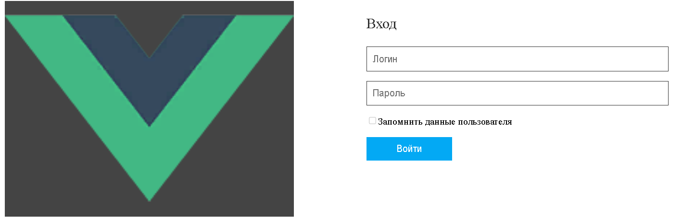
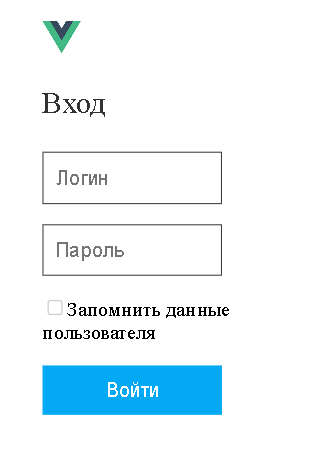

<p align = center>МИНИСТЕРСТВО НАУКИ И ВЫСШЕГО ОБРАЗОВАНИЯ

<p align = center>РОССИЙСКОЙ ФЕДЕРАЦИИ

<p align = center>ФЕДЕРАЛЬНОЕ ГОСУДАРСТВЕННОЕ БЮДЖЕТНОЕ ОБРАЗОВАТЕЛЬНОЕ УЧРЕЖДЕНИЕ ВЫСШЕГО ОБРАЗОВАНИЯ

<p align = center>«ВЯТСКИЙ ГОСУДАРСТВЕННЫЙ УНИВЕРСИТЕТ»

<p align = center>Институт математики и информационных систем

<p align = center>Факультет автоматики и вычислительной техники

<p align = center>Кафедра систем автоматизации управления

<p align = right>Дата сдачи на проверку:

<p align = right>«___» __________ 2022 г.

<p align = right>Проверено:

<p align = right>«___» __________ 2022 г.

<p align = center>Отчет по лабораторной работе № 2

<p align = center>по дисциплине

<p align = center>«Web-программирование»

<p align = center>Вариант 1


<p align = center>Разработал студент гр. ИТб-2301-01-00 ________________ /Орлов М.А./

<p align = center>Проверил ст. преподаватель _________________ /Земцов М.А./

<p align = center>Работа защищена с оценкой «___________» «___» __________ 2022 г.


<p align = center>Киров 2022

__________
Цель:  отобразить на странице адаптивный блок авторизации

Задачи:

1. Организовать процесс работы над лабораторной работой
1. Отобразить блок авторизации на странице

Ход выполнения:

1. Организовать процесс работы над лабораторной работой

Для работы в репозитории *[ссылка на репозиторий](https://github.com/fasadar2/webit)* на сайте github.com от ветки lab1 создана новая ветвь с названием lab2. Cоздан Vue проект c названием login. В этом проекте был добавлен компонент login.vue.

2. Отобразить блок авторизации на странице

В ходе выполнения работы был реализован блок регистрации для компьютерной версии сайта, который содержит в себе: большой логоти, который распологается слева, название, два поля ввода для логина и пароля, checkBox для сохранения введенных данных и кнопку авторизации. Отображаемый на странице блок авторизации представлен на рисунке 1.

<p align=center></p>

<p align = center>Рисунок 1 – Блок регистрации для компьютерной версии сайта

Для мобильной версии сайта на странице присутствуют все те же компоненты, что и для компьютерной, но с некоторыми отличиями: маленький логотип, расположенный сверху, подсказки для полей ввода выполнены с помощью атрибута placeholder. Блок авторизации для мобильных устройств отображен на рисунке 2.


<p align=center></p>

<p align = center>Рисунок 2 – Блок регистрации для мобильной версии сайта

Листинг компонента Registration.vue представлен в приложении А.

Вывод: в ходе лабораторной работы организовано рабочее пространство, закреплены навыки работы с веб-фреймворком VUE. Также были освежены знания языков разметки html и css. На практике реализован адаптивный блок авторизации.

<p align = center>2

__________

<p align = center>Приложение А

<p align = center>(обязательное) 

<p align = center>Листинг компонента login.vue

```html
<template>
<div class="form-div">

<form class="form">

<h3 class="form_title">Вход</h3>
<p>
<input type="text" class="form_input" placeholder="Логин">
</p>
<p class="checkbox" >
<input type="password" class="form_input" placeholder="Пароль">
</p>
<p>
<input type="checkbox">
<span>Запомнить данные пользователя</span>
</p>
<p>
<button class="form_btn">Войти</button>
</p>
</form>
</div>
</template>
<script lang="ts">
import Vue from 'vue';

export default Vue.extend({
  name: 'Login',
  props: {
  },
});
</script>
<style scoped>
.form-div {
width: 80%;
height: 600px;
display: flex;
justify-content: space-between;
}
.logo_big {
width: 40%;
height:60%;
background: #444;
}
.logo {
display: none;
width: 30px;
padding-top: 10px;
}
.form {
width: 50%;
margin-left: 40px;
}
.form_title {
font-size: 1.5rem;
font-weight: 500;
color: #333;
}
.form_input {
width: 80%;
padding: 10px;
border: solid 1px #333;
font-size: inherit;
}
.checkbox {
}
.form_btn {
border: none;
cursor: pointer;
font-size: inherit;
background-color: #03a9f4;
color: #fff;
padding: 10px 50px;
}
@media(max-width: 768px) {
.form-div {
height: 300px;
}
.logo_big {
display: none;
}
.logo {
display: flex;
}
}
@media(max-width: 480px) {
.form-div {
width: 300px;
}
}
</style>

```