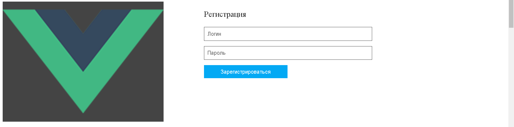
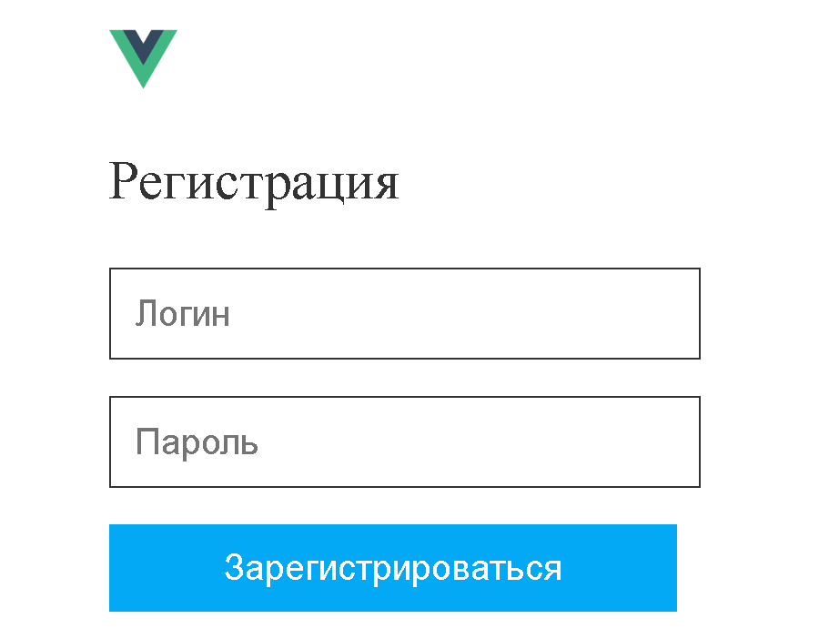
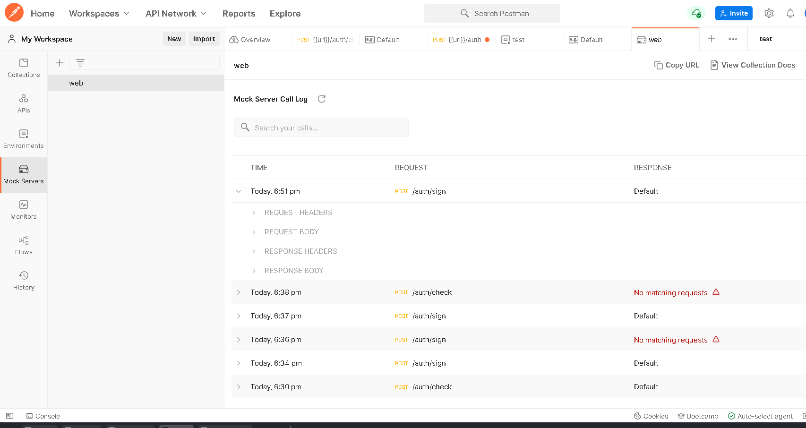
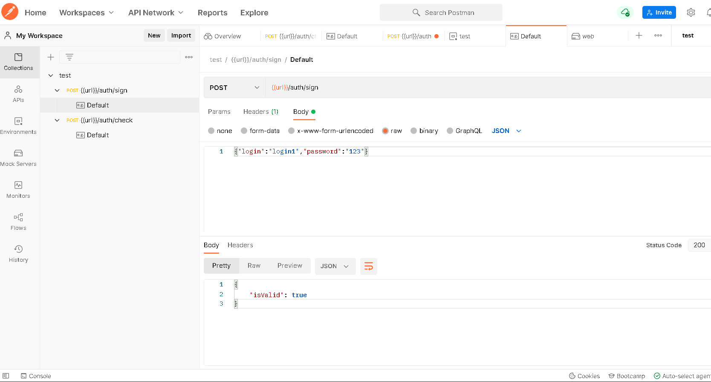
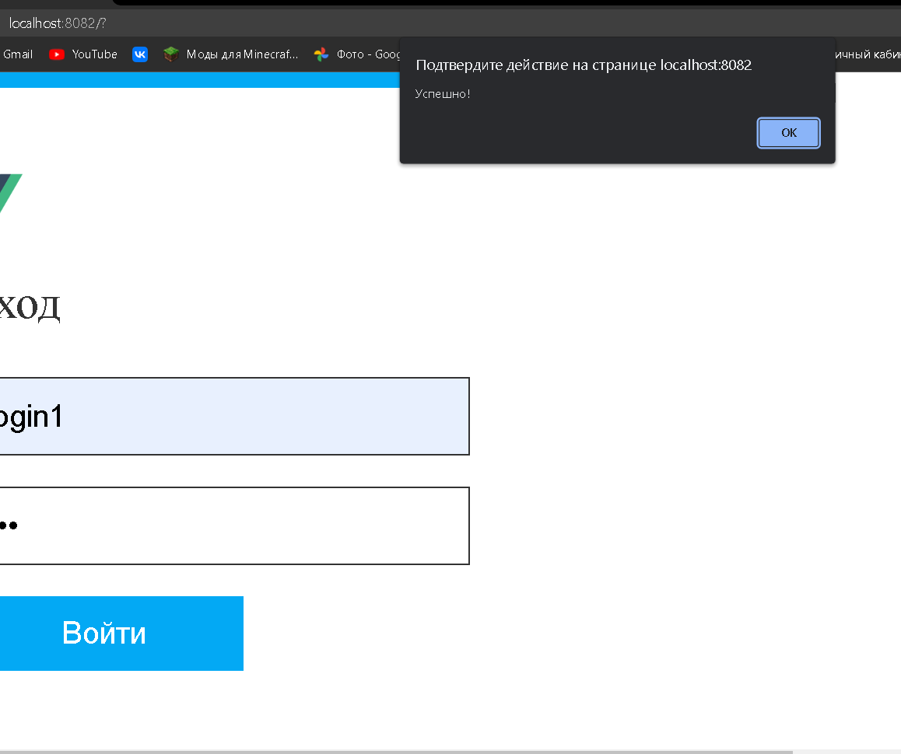
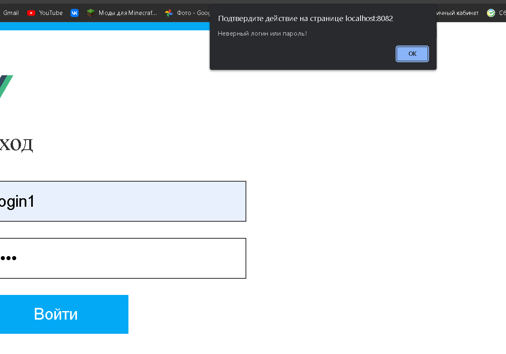
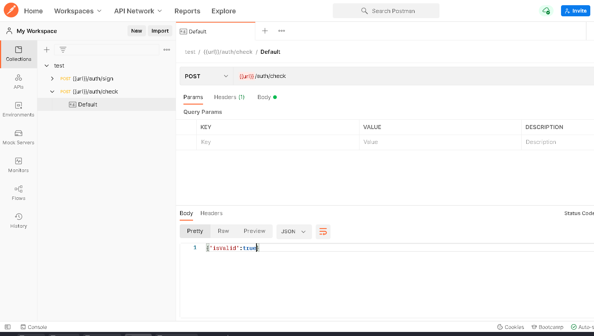
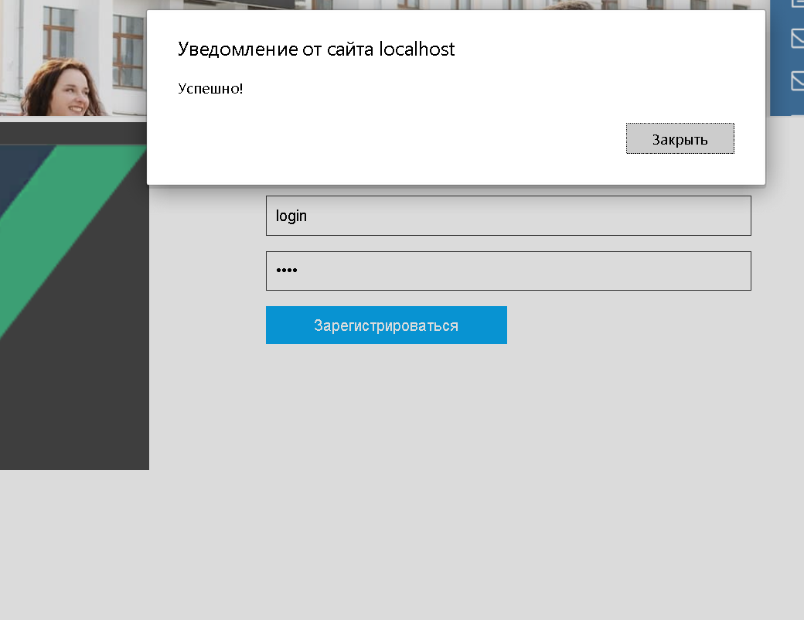
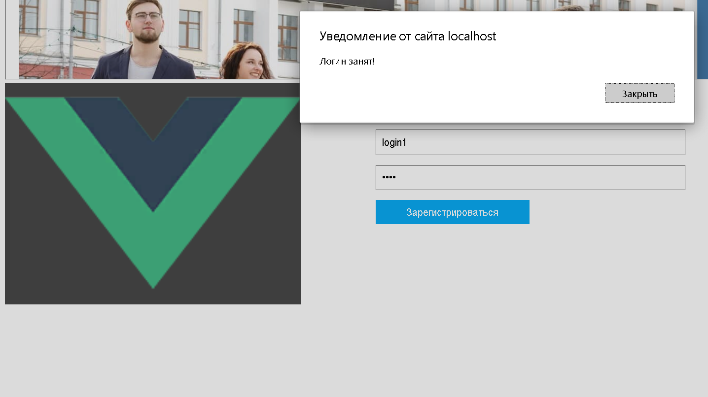

<p align = center>МИНИСТЕРСТВО НАУКИ И ВЫСШЕГО ОБРАЗОВАНИЯ

<p align = center>РОССИЙСКОЙ ФЕДЕРАЦИИ

<p align = center>ФЕДЕРАЛЬНОЕ ГОСУДАРСТВЕННОЕ БЮДЖЕТНОЕ ОБРАЗОВАТЕЛЬНОЕ УЧРЕЖДЕНИЕ ВЫСШЕГО ОБРАЗОВАНИЯ

<p align = center>«ВЯТСКИЙ ГОСУДАРСТВЕННЫЙ УНИВЕРСИТЕТ»

<p align = center>Институт математики и информационных систем

<p align = center>Факультет автоматики и вычислительной техники

<p align = center>Кафедра систем автоматизации управления
<br>
<br>
<br>
<br>

<p align = right>Дата сдачи на проверку:

<p align = right>«___» __________ 2022 г.

<p align = right>Проверено:

<p align = right>«___» __________ 2022 г.
<br>
<br>
<br>
<br>
<br>


<p align = center>Отчет по лабораторной работе № 3

<p align = center>по дисциплине

<p align = center>«Web-программирование»

<br>
<br>
<br>
<br>


<p align = center>Разработал студент гр. ИТб-2301-01-00 ________________ /Орлов М.А./

<p align = center>Проверил ст. преподаватель _________________ /Земцов М.А./

<p align = center>Работа защищена с оценкой «___________» «___» __________ 2022 г.

<br>
<br>
<br>
<br>

<p align = center>Киров 2022

<hr>
Цель:  провести тестирование отправки axios-запроса на mock-сервер

Задачи:

1. Организовать процесс работы над лабораторной работой
1. Сверстать блок регистрации
1. Создать mock-сервер в Postman
1. Отправить запрос на mock-сервер и получить ответ

Ход выполнения:

1. Организовать процесс работы над лабораторной работой

Для работы в репозитории *[ссылка на репозиторий](https://github.com/fasadar2/webit)* на сайте github.com была создана новая ветвь с названием lab3 от ветки lab2.

2. Сверстать блок регистрации

В компонент Registration была добавлена адаптивная верстка блока регистрации. Результут представлен на рисунке 1 и 2.

<p align=center></p>

<p align = center>Рисунок 1 – Регистрация desctop

<p align=center></p>

<p align = center>Рисунок 2 – Регистрация для мобильных устройств

3. Создать mock-сервер в Postman

В ходе выполнения работы с помощью Postman был создан Mock Server. Созданный Mock Server представлен на рисунке 3. 

<p align=center></p>

<p align = center>Рисунок 3 – Mock Server

В рамках лабораторной работы были созданы два Post запроса.
В первом случае Post запрос используется для проверки введенного логина и пароля. Реализация запроса изображена на рисунке 4. Результаты его работы показаны на рисунках 5 и 6.

<p align=center></p>

<p align = center>Рисунок 4 – Post запрос

<p align=center></p>

<p align = center>Рисунок 5 – Удачный вход

<p align=center></p>

<p align = center>Рисунок 6 – Неудачный вход

Во втором случае Post запрос используется для проверки уникальности логина при регистрации. Реализация запроса изображена на рисунке 7. Результаты его работы показаны на рисунках 8 и 9.

<p align=center></p>

<p align = center>Рисунок 7 – Post запрос

<p align=center></p>

<p align = center>Рисунок 8 – Удачная регистрация

<p align=center></p>

<p align = center>Рисунок 9 – Неудачная регистрация

В компоненте Registration предусмотрена проверка на ввод почты, пароля и совпадения введенных паролей
Листинг компонента Registration представлен в приложении А.

Вывод: в ходе лабораторной работы было проведено тестирование отправки axios-запроса на mock-сервер.

<p align = center>Приложение А

<p align = center>(обязательное) 

<p align = center>Листинг компонента register.vue

```html
<template>
<div class="form-div">

<form class="form">

<h3 class="form_title">Регистрация</h3>
<p>
<input type="text" id="regLog" class="form_input" placeholder="Логин">
</p>
<p class="checkbox" >
<input type="password" id="regPass" class="form_input" placeholder="Пароль">
</p>
<p>
<button type="button" v-on:click="signOn" class="form_btn">Зарегистрироваться</button>
</p>
</form>
</div>
</template>
<script lang="ts">
import Vue from 'vue';
import axios from 'axios';

export default Vue.extend({
  name: 'Register',
  props: {
  },
  methods: {
    toggleStyleEnter() {
      const enter :HTMLDivElement = document.querySelector('.autorization_block');
      const reg :HTMLDivElement = document.querySelector('.registrationtion_block');
      const enterBtn :HTMLDivElement = document.querySelector('.EnterBtn');
      const regBtn :HTMLDivElement = document.querySelector('.RegBtn');
      enter.style.display = 'flex';
      reg.style.display = 'none';
      enterBtn.style.color = 'green';
      regBtn.style.color = 'black';
    },
    toggleStyleRegister() {
      const enter :HTMLDivElement = document.querySelector('.autorization_block');
      const reg :HTMLDivElement = document.querySelector('.registrationtion_block');
      const enterBtn :HTMLDivElement = document.querySelector('.EnterBtn');
      const regBtn :HTMLDivElement = document.querySelector('.RegBtn');
      enter.style.display = 'none';
      reg.style.display = 'flex';
      enterBtn.style.color = 'black';
      regBtn.style.color = 'green';
    },
    signOn() {
      const regLog :HTMLInputElement = document.getElementById('regLog') as HTMLInputElement;
      const regPass :HTMLInputElement = document.getElementById('regPass') as HTMLInputElement;
      const config = {
        url: 'https://a02f853a-6182-4e81-ac3e-eba5acd42df0.mock.pstmn.io/auth/check',
      };
      const data = {
        login: regLog.value,
      };
      if (regLog.value === '') {
        alert('Введите логин!');
        return;
      }
      if (regPass.value === '') {
        alert('Введите пароль!');
        return;
      }
      axios.post(config.url, data, { headers: { 'x-mock-match-request-body': true } })
        .then((response) => {
          console.log(response.data.isValid);
          if (response.data.isValid) {
            alert('Логин занят!');
          }
        })
        .catch((error) => {
          console.log(error);
          alert('Успешно!');
        });
    },
  },
});
</script>
<style scoped>
.form-div {
width: 80%;
height: 600px;
display: flex;
justify-content: space-between;
}
.logo_big {
width: 40%;
height:60%;
background: #444;
}
.logo {
display: none;
width: 30px;
padding-top: 10px;
}
.form {
width: 50%;
margin-left: 40px;
}
.form_title {
font-size: 1.5rem;
font-weight: 500;
color: #333;
}
.form_input {
width: 80%;
padding: 10px;
border: solid 1px #333;
font-size: inherit;
}
.checkbox {
}
.form_btn {
border: none;
cursor: pointer;
font-size: inherit;
background-color: #03a9f4;
color: #fff;
padding: 10px 50px;
}
@media(max-width: 768px) {
.form-div {
height: 300px;
}
.logo_big {
display: none;
}
.logo {
display: flex;
}
}
@media(max-width: 480px) {
.form-div {
width: 300px;
}
}
</style>

```

<p align = center>Приложение Б

<p align = center>(обязательное) 

<p align = center>Листинг компонента enter.vue

```html
<template>
<div class="form-div">

<form class="form">

<h3 class="form_title">Вход</h3>
<p>
<input type="text" id="log" class="form_input" placeholder="Логин">
</p>
<p class="checkbox" >
<input type="password" id="password" class="form_input" placeholder="Пароль">
</p>
<p>
<button type="button" v-on:click="signIn" class="form_btn">Войти</button>
</p>
</form>
</div>
</template>
<script lang="ts">
import Vue from 'vue';
import axios from 'axios';

export default Vue.extend({
  name: 'Enter',
  props: {
  },
  methods: {
    toggleStyleEnter() {
      const enter :HTMLDivElement = document.querySelector('.autorization_block');
      const reg :HTMLDivElement = document.querySelector('.registrationtion_block');
      const enterBtn :HTMLDivElement = document.querySelector('.EnterBtn');
      const regBtn :HTMLDivElement = document.querySelector('.RegBtn');
      enter.style.display = 'flex';
      reg.style.display = 'none';
      enterBtn.style.color = 'green';
      regBtn.style.color = 'black';
    },
    toggleStyleRegister() {
      const enter :HTMLDivElement = document.querySelector('.autorization_block');
      const reg :HTMLDivElement = document.querySelector('.registrationtion_block');
      const enterBtn :HTMLDivElement = document.querySelector('.EnterBtn');
      const regBtn :HTMLDivElement = document.querySelector('.RegBtn');
      enter.style.display = 'none';
      reg.style.display = 'flex';
      enterBtn.style.color = 'black';
      regBtn.style.color = 'green';
    },
    signIn() {
      const log :HTMLInputElement = document.getElementById('log') as HTMLInputElement;
      const password :HTMLInputElement = document.getElementById('password') as HTMLInputElement;
      const config = {
        url: 'https://a02f853a-6182-4e81-ac3e-eba5acd42df0.mock.pstmn.io/auth/sign',
      };
      const data = {
        login: log.value,
        password: password.value,
      };
      axios.post(config.url, data, { headers: { 'x-mock-match-request-body': true } })
        .then((response) => {
          console.log(response.data.isValid);
          if (response.data.isValid) {
            alert('Успешно!');
          }
        })
        .catch((error) => {
          console.log(error);
          alert('Неверный логин или пароль!');
        });
    },
  },
});
</script>
<style scoped>
.form-div {
width: 80%;
height: 600px;
display: flex;
justify-content: space-between;
}
.logo_big {
width: 40%;
height:60%;
background: #444;
}
.logo {
display: none;
width: 30px;
padding-top: 10px;
}
.form {
width: 50%;
margin-left: 40px;
}
.form_title {
font-size: 1.5rem;
font-weight: 500;
color: #333;
}
.form_input {
width: 80%;
padding: 10px;
border: solid 1px #333;
font-size: inherit;
}
.checkbox {
}
.form_btn {
border: none;
cursor: pointer;
font-size: inherit;
background-color: #03a9f4;
color: #fff;
padding: 10px 50px;
}
@media(max-width: 768px) {
.form-div {
height: 300px;
}
.logo_big {
display: none;
}
.logo {
display: flex;
}
}
@media(max-width: 480px) {
.form-div {
width: 300px;
}
}
</style>

